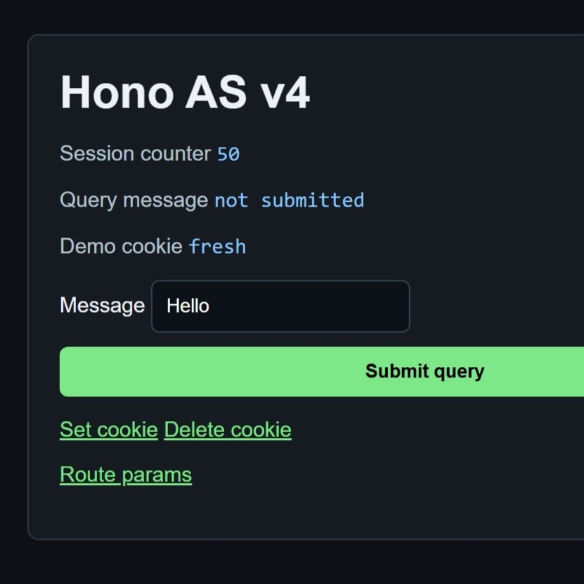

# ShadowNine Web Server



A Portal 2: Community Edition addon that experiments with a Hono-style web server framework written in AngelScript.

The addon includes:

- A tiny Hono-like AngelScript framework in `code/hono`
- A demo app in `code/app`
- P2CE server command bindings in `code/commands.as`
- A playable map at `maps/minecraft.bsp`

## Install

Install this addon with the local folder method. Place the whole `shadowninewebserver` folder directly inside P2CE's `addons` directory:

```text
C:\Program Files (x86)\Steam\steamapps\common\Portal 2 Community Edition\p2ce\addons\shadowninewebserver
```

### Download Without Git

Normal users do not need Git installed.

1. Open the GitHub page:

```text
https://github.com/ShadowNineX/p2ce-hono-web-server
```

2. Click the green `Code` button.
3. Click `Download ZIP`.
4. Extract the downloaded ZIP.
5. Rename the extracted folder from `p2ce-hono-web-server-main` to `shadowninewebserver`.
6. Move that `shadowninewebserver` folder into:

```text
C:\Program Files (x86)\Steam\steamapps\common\Portal 2 Community Edition\p2ce\addons
```

The final layout should look like this:

```text
Portal 2 Community Edition
`-- p2ce
    `-- addons
        `-- shadowninewebserver
            |-- addon.kv3
            |-- code
            |-- maps
            `-- mapsrc
```

Keep `addon.kv3` at the root of the addon folder. Do not place the addon inside `steamapps\workshop\content`, and do not install it as only a packed VPK if you want the AngelScript code to load. The folder method keeps `code\sv_init.as` and the included scripts available as loose files for P2CE's script loader.

After copying the folder, launch Portal 2: Community Edition and make sure the local addon named `Web Server` is enabled in the addon list if it is not already mounted.

## Setup

Launch Portal 2: Community Edition with the remote console port enabled:

```text
-netconport 8080
```

The local browser bridge expects that port so it can send HTTP-looking requests into P2CE through the Source remote console.

Once the game is running, the demo page is intended to be reached at:

```text
http://localhost:8080
```

## Map

The included map can be loaded from the developer console:

```text
map minecraft
```

The compiled BSP lives in `maps/minecraft.bsp`. The Hammer/source files are kept in `mapsrc`.

## Code Layout

- `code/sv_init.as` is the server-side AngelScript entry point loaded by P2CE.
- `code/commands.as` contains the raw P2CE server command registration.
- `code/hono/hono.as` contains the Hono-style framework.
- `code/hono/p2ce.as` adapts P2CE console commands into framework requests.
- `code/hono/crypto.as` contains simple helper code used by sessions/cookies.
- `code/app/app.as` defines the demo application routes.

## VS Code Settings

The workspace settings live at `.vscode/settings.json`. This file is tracked in Git because the AngelScript analyzer needs it to understand this project. P2CE does not read this file at runtime.

Before using the VS Code AngelScript analyzer, load into a map in P2CE and run these console commands:

```text
sv_scriptsystem_dump
sv_scriptsystem_dump_lsp
```

Run them while a map is active. They generate the script API/predefined files used by the editor tooling, including the `as.predefined` file referenced below.

Current settings:

```json
{
    "angelScript.includePath": [
        ".",
        "app",
        "hono",
        "C:\\Program Files (x86)\\Steam\\steamapps\\common\\Portal 2 Community Edition\\p2ce\\addons\\shadowninewebserver\\code",
        "C:\\Program Files (x86)\\Steam\\steamapps\\common\\Portal 2 Community Edition\\p2ce\\addons\\shadowninewebserver\\code\\app",
        "C:\\Program Files (x86)\\Steam\\steamapps\\common\\Portal 2 Community Edition\\p2ce\\addons\\shadowninewebserver\\code\\hono"
    ],
    "angelScript.forceIncludePredefined": [
        "C:\\Program Files (x86)\\Steam\\steamapps\\common\\Portal 2 Community Edition\\p2ce\\data\\server\\as.predefined"
    ],
    "angelScript.implicitMutualInclusion": false,
    "angelScript.definedSymbols": [
        "CLIENT",
        "SERVER"
    ]
}
```

What each setting is doing:

- `angelScript.includePath` tells the analyzer where `#include` files can be found. The relative entries `.`, `app`, and `hono` are for opening the `code` folder directly. The absolute entries point at this exact addon's `code`, `code/app`, and `code/hono` folders, which helps when opening the addon root in VS Code.
- `angelScript.forceIncludePredefined` points at this P2CE install's generated `as.predefined` file. That file describes engine-provided APIs such as `ServerCommand`, `CommandArgs`, `Msg`, `ConVarRef`, and other symbols that do not exist in this repo.
- `angelScript.implicitMutualInclusion` is set to `false` so the analyzer respects explicit `#include` order. This better matches how the scripts are actually loaded and helps catch missing includes.
- `angelScript.definedSymbols` defines both `CLIENT` and `SERVER`, so the analyzer can understand guarded blocks like `#if SERVER`. The addon itself keeps the command bindings server-side.

The absolute paths are specific to this local Steam install. If the addon is moved to another machine, another Steam library, or a different P2CE install path, update the absolute paths in `.vscode/settings.json`.
